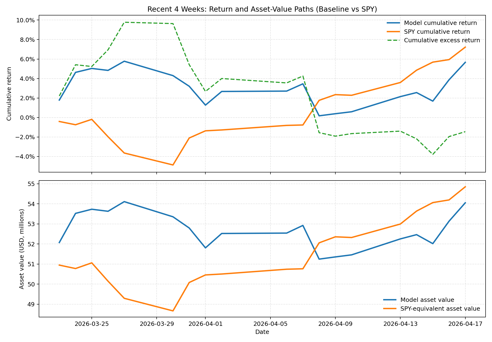

# Four-Week Consolidated Strategy Report (As of 2026-04-17)

Author: Ruiwen HE, Xin Jin

## 1) Executive Summary
This report is designed for readers without access to code, logs, or internal run scripts.

Across the latest four official weeks, the baseline strategy delivered strong absolute gains, while cumulative performance was slightly below SPY because of two weak middle weeks.

- Four-week model return (baseline): **+5.66%**
- Four-week benchmark return (SPY): **+7.22%**
- Four-week excess return: **-1.56%**
- Live-to-date return (2026-03-18 to 2026-04-17, baseline): **+5.28%**
- Live-to-date excess return: **+1.61%**

## 2) Strategy Logic, Theory, and Uniqueness
The strategy is a short-horizon momentum ranking model on a date-consistent S&P 500 universe.

Each week, the process is straightforward: build the eligible universe for that date, compute momentum scores, select top-ranked stocks, and hold until the next rebalance.

Momentum is computed with EWMA weighting so that recent returns contribute more than older returns:

$$
r_{i,t}=\frac{C_{i,t}}{C_{i,t-1}}-1,
\quad
Score_{i,t}=\sum_{k=0}^{K-1}w_k r_{i,t-k},
\quad
w_k=(1-\lambda)\lambda^k
$$

Risk and implementation controls are explicit.

- Rebalance frequency: weekly.
- Execution: next trading session after signal.
- Baseline production book: long-only top 15 names.
- Week 2 change: fixed 8% single-name stop-loss activated on 2026-03-30.
- Week 4 change: added side-by-side improved diversified variant with broader holdings (~30 names).

Survivorship bias is controlled by strict date-consistent index membership.

At each historical signal date, only stocks that were actual constituents on that date are eligible.

This makes historical inference materially more reliable than backfilling with current constituents.

The model's uniqueness is the combination of transparent EWMA alpha logic, strict universe integrity, explicit live risk-policy rollout, and side-by-side robustness testing.

## 3) Four-Week Performance and Multi-Dimensional Curve
### Weekly summary (baseline)

| Week | Dates | Model | SPY | Excess | PnL |
|---|---|---:|---:|---:|---:|
| Week 1 | 03/23-03/27 | +5.7748% | -3.6440% | +9.4188% | +$2.00M |
| Week 2* | 03/30-04/03 | -2.9339% | +2.4558% | -5.3898% | -$0.82M |
| Week 3 | 04/06-04/10 | -2.0280% | +3.6031% | -5.6310% | -$1.07M |
| Week 4 | 04/13-04/17 | +5.0433% | +4.8316% | +0.2117% | +$1.77M |

* 04/03 was Good Friday (holiday), so Week 2 has four trading days.

### Multi-dimensional performance figure

Top panel: cumulative return paths for baseline, SPY, and cumulative excess return.

Bottom panel: asset-value trajectories for baseline and an SPY-equivalent portfolio with the same initial capital.

This view improves readability by linking return spreads and wealth outcomes in one chart.

### Improved diversified in Week 4
- Improved diversified weekly return: **+4.3812%**
- SPY weekly return: **+4.8316%**
- Excess return: **-0.4504%**

Interpretation: broader holdings reduced concentration, but in this specific week the diversified variant lagged the more concentrated baseline.

## 4) Major Up/Down Days and News Attribution
### 03/31 to 04/01: relative drawdown phase
- Market context: broad risk-on rebound as de-escalation expectations improved.
- Sector dynamic: equities advanced broadly while oil eased and energy lagged.
- Strategy impact: prior energy tilt drove relative underperformance versus SPY.

### 04/08: largest relative loss day in Week 3
- Market context: ceasefire-related repricing continued.
- Outcome: benchmark advanced while energy-linked exposures remained weak.
- Strategy impact: significant one-day negative spread versus SPY.

### 04/16: strongest alpha day in Week 4
- Market context: semiconductor and AI supply-chain names rallied strongly.
- Reported leaders: AMD, LITE, COHR and related names.
- Strategy impact: holdings alignment with leadership produced strong positive excess return.

### 04/17: strong close to the period
- Market context: Strait of Hormuz reopening headlines and lower oil supported risk-on flows.
- Strategy impact: portfolio appreciated strongly and stayed positive on excess return.

## 5) Overall Evaluation, Risk, Forecast, and Next Steps
### Full evaluation to date (baseline, 2026-03-18 to 2026-04-17)
- Cumulative model return: **+5.28%**
- Cumulative benchmark return: **+3.67%**
- Cumulative excess return: **+1.61%**
- Sharpe ratio (annualized from daily returns): **2.68**
- Sortino ratio (annualized from daily returns): **2.31**

### Recent four-week risk profile
- Four-week Sharpe: **3.19**
- Four-week Sortino: **2.81**

These risk-adjusted readings are favorable, but confidence remains limited because the live window is short and event-heavy.

### Near-term distribution-based forecast
Using recent four-week daily return distribution as a simple proxy:

- Implied weekly mean: **+1.50%**
- Implied weekly volatility: **3.35%**
- Approximate 95% weekly return interval: **[-5.05%, +8.06%]**

Base case: mildly positive if growth and technology leadership persists.

Risk case: abrupt macro regime rotation can still generate material left-tail outcomes.

### Improvement priorities
1. Add adaptive sector-balance constraints.
2. Add tactical hedge triggers on macro stress sessions.
3. Upgrade fixed stop-loss to volatility-aware trailing logic.
4. Add regime-sensitive ensemble blending of baseline and diversified variants.
5. Extend live history before making stronger statistical claims.
